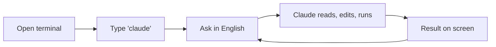

# Claude Code Cheatsheet

> One page. Print it. Stick it next to your monitor.

---

## What you're doing



---

## Install (one line)

| Computer | Paste this |
|---|---|
| Mac / Linux | `curl -fsSL https://claude.ai/install.sh \| bash` |
| Windows (PowerShell) | `irm https://claude.ai/install.ps1 \| iex` |

Verify: `claude --version` · Update: `claude update` · Diagnose: `claude doctor`

---

## Daily commands

| Command | What it does |
|---|---|
| `claude` | Start a session in the current folder |
| `claude "fix the failing test"` | One-shot prompt, then exit |
| `claude -c` | Continue the most recent session |
| `claude --resume` | Pick a past session to resume |
| <kbd>Ctrl</kbd>+<kbd>C</kbd> | Cancel / exit |
| <kbd>Esc</kbd> | Interrupt Claude mid-response |

---

## Slash commands (most useful)

| Command | Purpose |
|---|---|
| `/init` | Create a `CLAUDE.md` for the current folder |
| `/help` | List all commands |
| `/plan` | Plan Mode – propose steps, wait for approval |
| `/clear` | Reset conversation (keeps `CLAUDE.md`) |
| `/review` | Review the current branch / PR |
| `/compact` | Compress long conversation to free memory |
| `/cost` | Show tokens and cost so far |
| `/model` | Switch model (Opus / Sonnet / Haiku) |

---

## What a project folder looks like

```
project/
├── CLAUDE.md                 ← the note for Claude
└── .claude/
    ├── settings.json         ← team settings (commit)
    ├── settings.local.json   ← personal overrides (gitignore)
    ├── commands/             ← your custom shortcuts
    └── agents/               ← project-specific helpers
```

---

## `CLAUDE.md` skeleton

```markdown
# Project: <name>

## What it is
One paragraph.

## Tech / tools
- Language, framework, key libraries

## How to run
- `npm run dev`
- `npm test`

## Conventions
- Code style, naming, commit messages

## Gotchas
- Auth quirks, env vars, flaky tests
```

Keep under 150 lines. Place at repo root. Commit it.

---

## Five killer patterns

1. **Drop & analyze** – put a file in a folder, ask "summarize this in three bullets."
2. **Plan before code** – `/plan` for any change touching more than one file.
3. **Test generation** – "write tests for `src/utils/parseDate.ts` covering edge cases."
4. **Stack-trace triage** – paste an error, ask for a plain-English diagnosis + fix.
5. **Pre-push review** – `/review` before every `git push`.

---

## When stuck

| You see | Try |
|---|---|
| `command not found: claude` (Mac) | Restart terminal · `which claude` |
| `claude is not recognized` (Windows) | Restart terminal · `where claude` |
| `running scripts is disabled` (Win) | `Set-ExecutionPolicy -Scope CurrentUser RemoteSigned` |
| Login loop | `claude logout` then `claude` |
| Conversation feels off | `/clear` or `/compact` |
| Want to undo Claude's edit | `git diff` then `git checkout -- <file>` |

---

**Full guide:** [README.md](README.md) · **Official docs:** [docs.claude.com](https://docs.claude.com/en/docs/claude-code)
