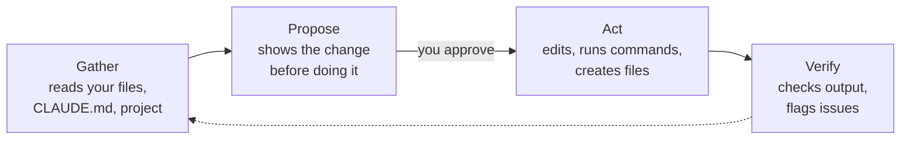

# Claude Code – 5-Minute Quickstart

> The shortest path from "what is Claude Code?" to "I'm using it."

**Languages:** **English** · [Русский](https://github.com/velesnitski/claude-code-quickstart/blob/main/README.ru.md)

---

## What is Claude Code?

A smart assistant that lives in your **terminal** (the black-and-white text window where developers type commands). You ask it things in plain English – it reads your files, edits them, runs commands, explains errors.

Think of it as **ChatGPT that can actually touch your computer**.

That's the whole experience. You type. It works. You read.

> **60-second demo video** – coming soon. Want to record one? Open a PR linking it here.

---

## How Claude works (the safe loop)

Claude doesn't just blurt out edits. Every action runs through a loop:

Three things to know:

- **Nothing changes without your "yes."** Claude shows the diff and asks before editing.
- **Use Plan Mode** (`/plan`) to see the *full* plan before any work starts – good for bigger changes.
- **Read your `CLAUDE.md`** – the more context that file gives, the less Claude has to ask.

---

## Install in one line

| Your computer | Paste this in your terminal |
|---|---|
| **Mac** / Linux | `curl -fsSL https://claude.ai/install.sh \| bash` |
| **Windows** (PowerShell) | `irm https://claude.ai/install.ps1 \| iex` |

> **Important:** Claude Code needs a **paid Claude plan** (Pro / Max / Team / Enterprise) or a **Console account** with API credits. The free Claude.ai plan doesn't include it. See [pricing](https://claude.com/pricing).
>
> **Prefer no terminal?** Get the **[Desktop app](https://claude.com/download)** – same agent, regular app window.

Don't have a terminal yet? Start at **[Step 1](docs/01-terminal.md)** below.

---

## The four steps

| # | Section | What you'll learn | Time |
|---|---|---|---|
| 1 | **[Open the terminal](docs/01-terminal.md)** | What a terminal is, which one to use | 2 min |
| 2 | **[Install Claude](docs/02-install.md)** | Get `claude` running on Mac or Windows | 2 min |
| 3 | **[Set up a project](docs/03-folders.md)** | What folders Claude looks at, and how to help it | 3 min |
| 4 | **[Try real examples](docs/04-examples.md)** | Five things to do today | 5 min |

Bonus: **[One-page cheatsheet](CHEATSHEET.md)** · **[PDF download](https://github.com/velesnitski/claude-code-quickstart/releases/latest)**

---

## Why this guide?

The other excellent guides – [Florian Bruniaux's Ultimate Guide](https://github.com/FlorianBruniaux/claude-code-ultimate-guide), [Cranot's Guide](https://github.com/Cranot/claude-code-guide), [awesome-claude-code](https://github.com/hesreallyhim/awesome-claude-code) – are 10,000+ lines each. Brilliant references, overwhelming for newcomers.

**This is the on-ramp.** Twelve minutes. Plain language. Pictures. When you're done, graduate:

- **Free official courses** – [Anthropic on Skilljar](https://anthropic.skilljar.com/) – start with **Claude Code 101**, then **Introduction to Agent Skills** and **Introduction to Subagents**.
- **Long-form references** – the guides linked above for exhaustive depth.

---

## Who is this for?

- **Marketing & content folks** explaining Claude Code to others.
- **Developers** wanting a fast on-ramp before diving into the long guides.
- **Team leads** onboarding people to AI-assisted workflows.

If you've never opened a terminal before – **start at [Step 1](docs/01-terminal.md)**. We'll walk you through it.

---

## Liked it?

If this guide saved you 5 minutes, **[give the repo a star](https://github.com/velesnitski/claude-code-quickstart/stargazers)** – it's the best way to help others find it.

## Contributing

- **Translations** – open a PR with `README.<lang>.md` (Russian already done at [README.ru.md](https://github.com/velesnitski/claude-code-quickstart/blob/main/README.ru.md)).
- **Screenshots & GIFs** – real captures beat ASCII art. Drop them in `docs/images/`.
- **Corrections** – fix a section directly, send a PR.
- See [CONTRIBUTING.md](https://github.com/velesnitski/claude-code-quickstart/blob/main/CONTRIBUTING.md) for details.

## License

[MIT](https://github.com/velesnitski/claude-code-quickstart/blob/main/LICENSE) – use freely, including in commercial training material.
