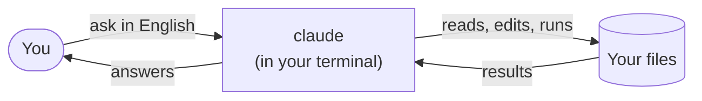

# Claude Code – 5-Minute Quickstart

> The shortest path from "what is Claude Code?" to "I'm using it."

[](LICENSE)
[](../../releases/latest)
[](CONTRIBUTING.md)
[](docs/02-install.md)
[](docs/02-install.md)

---

## What is Claude Code?

A smart assistant that lives in your **terminal** (the black-and-white text window where developers type commands). You ask it things in plain English – it reads your files, edits them, runs commands, explains errors.

Think of it as **ChatGPT that can actually touch your computer**.



Here's what it actually looks like on screen:

```
┌─ Terminal ──────────────────────────────────────────┐
│  ~/my-folder $ claude                               │
│                                                     │
│   ◆ Welcome to Claude Code                          │
│   > what's in this folder?                          │
│                                                     │
│  Reading report.csv... done.                        │
│  It's a Q1 sales report. Top product: Widget X.     │
│  Three findings:                                    │
│   1. Revenue up 12% over Q4.                        │
│   2. Row 47 has a missing date — worth checking.    │
│   3. APAC outperformed all regions (+22%).          │
│                                                     │
│   > _                                               │
└─────────────────────────────────────────────────────┘
```

That's the whole experience. You type. It works. You read.

---

## Install in one line

| Your computer | Paste this in your terminal |
|---|---|
| **Mac** / Linux | `curl -fsSL https://claude.ai/install.sh \| bash` |
| **Windows** (PowerShell) | `irm https://claude.ai/install.ps1 \| iex` |

Don't have a terminal yet? Start at **[Step 1](docs/01-terminal.md)** below.

---

## The four steps

| # | Section | What you'll learn | Time |
|---|---|---|---|
| 1 | **[Open the terminal](docs/01-terminal.md)** | What a terminal is, which one to use | 2 min |
| 2 | **[Install Claude](docs/02-install.md)** | Get `claude` running on Mac or Windows | 2 min |
| 3 | **[Set up a project](docs/03-folders.md)** | What folders Claude looks at, and how to help it | 3 min |
| 4 | **[Try real examples](docs/04-examples.md)** | Five things to do today | 5 min |

Bonus: **[One-page cheatsheet](CHEATSHEET.md)** · **[PDF download](../../releases/latest)**

---

## Why this guide?

The other excellent guides – [Florian Bruniaux's Ultimate Guide](https://github.com/FlorianBruniaux/claude-code-ultimate-guide), [Cranot's Guide](https://github.com/Cranot/claude-code-guide), [awesome-claude-code](https://github.com/hesreallyhim/awesome-claude-code) – are 10,000+ lines each. Brilliant references, overwhelming for newcomers.

**This is the on-ramp.** Twelve minutes. Plain language. Pictures. Then graduate to the long guides if you want depth.

---

## Who is this for?

- **Marketing & content folks** explaining Claude Code to others.
- **Developers** wanting a fast on-ramp before diving into the long guides.
- **Team leads** onboarding people to AI-assisted workflows.

If you've never opened a terminal before – **start at [Step 1](docs/01-terminal.md)**. We'll walk you through it.

---

## Contributing

- **Translations** – open a PR with `README.<lang>.md` (e.g. `README.ru.md`).
- **Screenshots** – real photos of the terminal beat ASCII art. Drop them in `docs/images/`.
- **Corrections** – fix a section directly, send a PR.
- See [CONTRIBUTING.md](CONTRIBUTING.md) for details.

## License

[MIT](LICENSE) – use freely, including in commercial training material.
