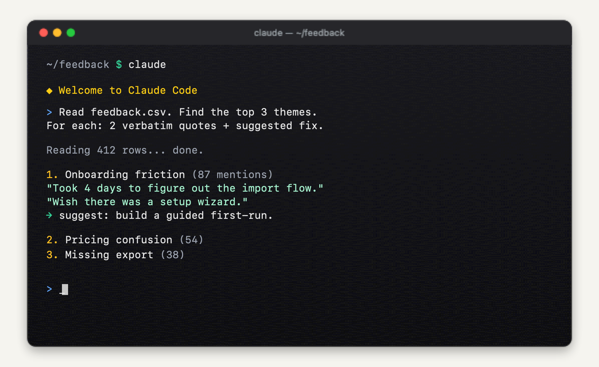

# Claude Code – краткое руководство (5 минут)

> Самый короткий путь от «что такое Claude Code?» до «я уже им пользуюсь».

**Языки:** [English](https://github.com/velesnitski/claude-code-quickstart) · **Русский**

---

## Что такое Claude Code?

Умный ассистент, который живёт в вашем **терминале** (это чёрно-белое текстовое окно, в котором разработчики набирают команды). Вы пишете запросы обычным языком – он читает ваши файлы, редактирует их, выполняет команды, объясняет ошибки.

Думайте об этом как о **ChatGPT, который реально может работать с вашим компьютером**.

---

## Установка одной командой

| Ваш компьютер | Вставьте в терминал |
|---|---|
| **Mac** / Linux | `curl -fsSL https://claude.ai/install.sh \| bash` |
| **Windows** (PowerShell) | `irm https://claude.ai/install.ps1 \| iex` |

> **Важно:** Claude Code работает только с **платными планами Claude** (Pro / Max / Team / Enterprise) или с аккаунтом **Anthropic Console** с API-кредитами. Бесплатный план Claude.ai не подходит. См. [тарифы](https://claude.com/pricing).
>
> **Не хотите работать в терминале?** Установите [десктоп-приложение](https://claude.com/download) – тот же ассистент в обычном окне.

Нет терминала? Начните с **[шага 1](docs/01-terminal.md)** ниже.

---

## Четыре шага

| № | Раздел | Чему научитесь | Время |
|---|---|---|---|
| 1 | **[Открыть терминал](docs/01-terminal.md)** | что такое терминал и какой выбрать | 2 мин |
| 2 | **[Установить Claude](docs/02-install.md)** | запустить `claude` на Mac или Windows | 2 мин |
| 3 | **[Подготовить проект](docs/03-folders.md)** | какие файлы Claude видит и как ему помочь | 3 мин |
| 4 | **[Реальные примеры](docs/04-examples.md)** | пять задач, которые можно выполнить уже сегодня | 5 мин |

Бонус: **[шпаргалка на одну страницу](CHEATSHEET.md)** · **[PDF-версия](https://github.com/velesnitski/claude-code-quickstart/releases/latest)**

---

## Для кого это?

- **Маркетологи и контент-команды**, которые рассказывают коллегам про Claude Code.
- **Разработчики**, которым нужен быстрый вход перед тем, как нырять в большие гайды.
- **Тимлиды**, обучающие людей AI-инструментам.

Никогда не открывали терминал? **Начните с [шага 1](docs/01-terminal.md)** – мы проведём за руку.

---

## Куда дальше

Когда базовое вы освоите, есть куда углубиться:

- **Подробный референс** – [Florian Bruniaux's Ultimate Guide](https://github.com/FlorianBruniaux/claude-code-ultimate-guide) (4k звёзд, очень подробно)
- **Живой референс** – [Cranot's Claude Code Guide](https://github.com/Cranot/claude-code-guide) (автообновление каждые 2 дня)
- **Инструменты и расширения** – [awesome-claude-code](https://github.com/hesreallyhim/awesome-claude-code)
- **Официальная документация** – [code.claude.com/docs](https://code.claude.com/docs)

---

## Понравилось?

Если этот гайд сэкономил вам 5 минут – **поставьте звезду репозиторию**. Это лучший способ помочь другим его найти.

## Помощь проекту

- **Переводы** – откройте PR с файлом `README.<lang>.md`
- **Скриншоты** – реальные снимки терминала ценнее ASCII-арта; кладите в `docs/images/`
- **Правки** – отредактируйте раздел напрямую и пришлите PR
- Подробности в [CONTRIBUTING.md](https://github.com/velesnitski/claude-code-quickstart/blob/main/CONTRIBUTING.md)

## Лицензия

[MIT](https://github.com/velesnitski/claude-code-quickstart/blob/main/LICENSE) – используйте свободно, в том числе в коммерческих обучающих материалах.
