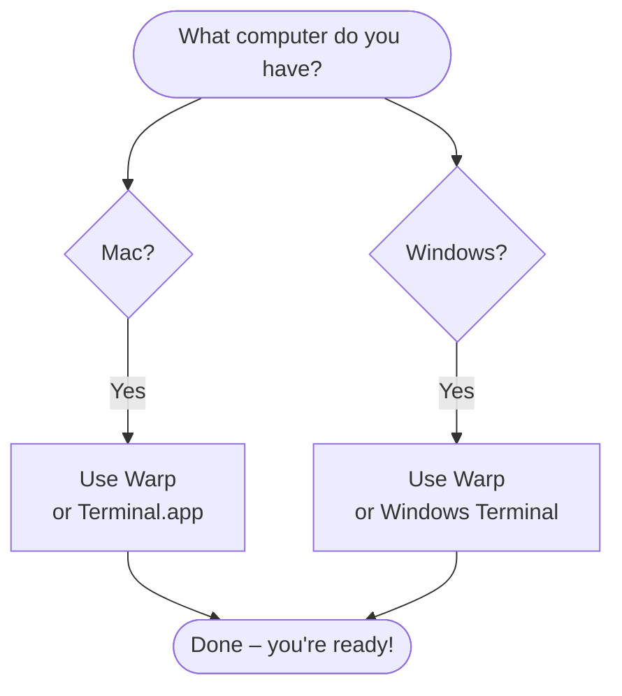

# 1. Open the Terminal

> **Time:** 2 min · **Goal:** Have a terminal window open and ready.

---

## What is a "terminal"?

It's the text-based window where you type commands. It looks like this:

> **Terminal**

```text
Last login: Tue May  6 09:14:22
~ $ _
```

The blinking cursor after `$` is waiting for you to type. That's it. No mouse, no buttons – just text in, text out.

Claude Code runs **inside** this window. So before installing Claude, you need a terminal.

---

## Which terminal should you use?



We recommend **[Warp](https://www.warp.dev/)** – it's free, modern, and built to work with Claude Code (it shows nice notifications when Claude finishes a task). But any terminal works.

---

## How to install your terminal

### On a Mac

**Option A – Warp (recommended):**
1. Go to [warp.dev](https://www.warp.dev/) and click **Download for Mac**.
2. Open the file you downloaded, drag Warp to Applications.
3. Open Warp from your Applications folder.

**Option B – Terminal (already on your Mac):**
1. Press <kbd>Cmd</kbd>+<kbd>Space</kbd>, type "Terminal", press Enter.

### On Windows

**Option A – Warp (recommended):**
1. Go to [warp.dev](https://www.warp.dev/) and click **Download for Windows**.
2. Run the installer.
3. Open Warp from the Start menu.

**Option B – Windows Terminal (free, official):**
1. Open the Microsoft Store, search "Windows Terminal", install.
2. Open it from the Start menu.

---

## What you should see

Once your terminal is open, you'll see something like:

> **Warp / Terminal**

```text
~ $ _
```

The `$` (or `>` on Windows PowerShell) means it's ready. **You're done with this step.**

---

**Next:** [Install Claude →](02-install.md)
