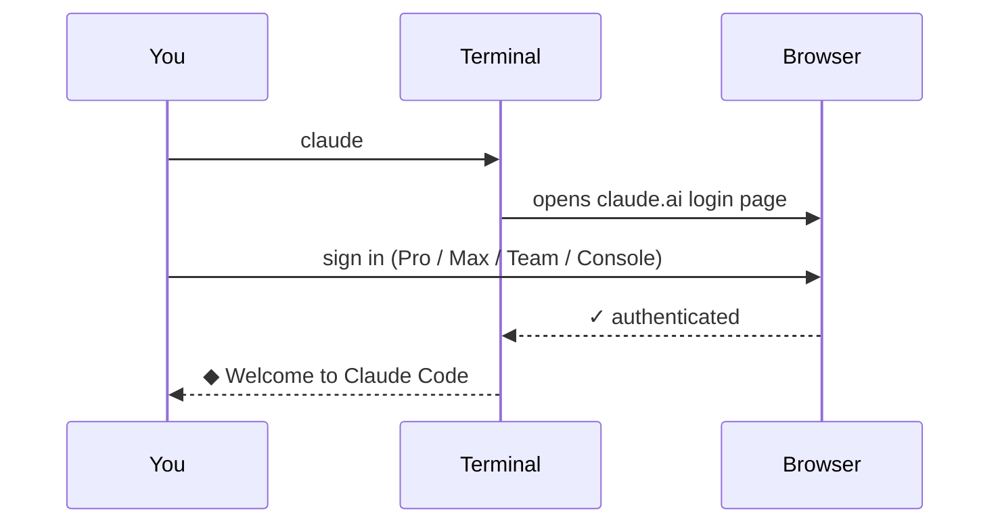

# 2. Install Claude

> **Time:** 2 min · **Goal:** Run `claude` from your terminal.

---

## What you need first

> **You need a paid Claude plan to use Claude Code.** The free Claude.ai plan does **not** include it. Any one of these works:
>
> - **Claude Pro / Max / Team / Enterprise** – sign up at [claude.com/pricing](https://claude.com/pricing). Recommended for individuals and most teams.
> - **Anthropic Console** account with API credits – [console.anthropic.com](https://console.anthropic.com/). Pay-as-you-go.
> - Cloud provider (Bedrock / Vertex AI / Foundry) – usually for enterprise.

Plus:

- A terminal (see [section 1](01-terminal.md)).
- macOS 13+, Windows 10 (1809+), or Linux (Ubuntu 20+, Debian 10+, Alpine 3.19+).
- 4 GB+ RAM, internet connection.

> **Don't want to use a terminal at all?** Download the [Claude Desktop app](https://claude.com/download) – same agent in a regular app window, no terminal needed. The rest of this guide assumes the terminal version.

---

## The big picture


---

## Step 1 – Paste the install command

### On a Mac

**Recommended – native installer** (auto-updates, no extras to install):

```bash
curl -fsSL https://claude.ai/install.sh | bash
```

**If you use Homebrew:**

```bash
brew install --cask claude-code
```

> Homebrew installs do **not** auto-update. Run `brew upgrade claude-code` to get new versions.

### On Windows

**Recommended – PowerShell native installer:**

```powershell
irm https://claude.ai/install.ps1 | iex
```

> If PowerShell says *"running scripts is disabled on this system"*, run this once and retry:
> ```powershell
> Set-ExecutionPolicy -Scope CurrentUser RemoteSigned
> ```

**For CMD users (not PowerShell):**

```batch
curl -fsSL https://claude.ai/install.cmd -o install.cmd && install.cmd && del install.cmd
```

> Not sure which one you're in? PowerShell shows `PS C:\Users\You>`; CMD shows `C:\Users\You>` (no `PS`).

**If you use WinGet:**

```powershell
winget install Anthropic.ClaudeCode
```

> Recommended on Windows: also install [Git for Windows](https://git-scm.com/downloads/win). Claude Code uses it for some shell features. Optional but smoother.

### On Linux / WSL

Same as Mac:

```bash
curl -fsSL https://claude.ai/install.sh | bash
```

Or use the package manager for your distro – see the [official guide](https://code.claude.com/docs/en/setup#install-with-linux-package-managers) for `apt` / `dnf` / `apk` repos.

---

## Step 2 – Restart your terminal

Close the terminal window. Open a new one. (This makes sure your computer "sees" the new `claude` command.)

---

## Step 3 – Run Claude for the first time

In the new terminal, type:

```bash
claude
```

**What happens:**



A browser window opens. Sign in with your Claude account (the one with your paid plan). The browser sends a token back to the terminal. **You only do this once per computer.**

After signing in:

> **Terminal**

```
~ $ claude

  ◆ Welcome to Claude Code
  > _
```

The `>` is Claude waiting for you to type a question. **You're installed and ready.**

Press <kbd>Ctrl</kbd>+<kbd>C</kbd> to exit any time.

---

## Verify it worked

```bash
claude --version    # should print a version number
claude doctor       # deeper health check
```

---

## If something goes wrong

| What you see | What to do |
|---|---|
| Mac says "command not found: claude" | Close & reopen the terminal. Check `which claude`. |
| Windows says "claude is not recognized" | Close & reopen PowerShell. Sign out / sign in to Windows so the PATH refreshes. |
| Windows says "running scripts is disabled" | Run `Set-ExecutionPolicy -Scope CurrentUser RemoteSigned` once, then retry. |
| Windows says "'irm' is not recognized" | You're in CMD, not PowerShell – use the CMD command above. |
| The login keeps looping | Run `claude logout`, then `claude` again. |
| "Invalid plan" or no Code access | Your Claude.ai account is on the **free** plan. Upgrade to Pro/Max/Team or use a Console account. |
| Antivirus blocks the installer (Windows) | Allow it – the installer is signed by Anthropic. |

Still stuck? Official troubleshooting: [code.claude.com/docs/en/troubleshoot-install](https://code.claude.com/docs/en/troubleshoot-install).

---

**Next:** [Set up a project →](03-folders.md)
