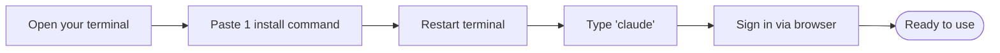
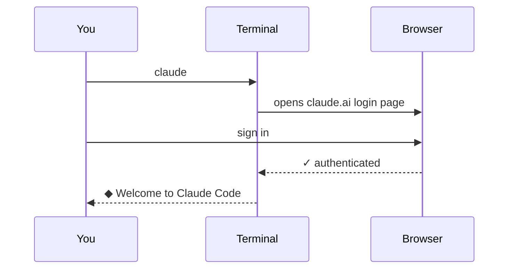

# 2. Install Claude

> **Time:** 2 min · **Goal:** Type `claude` in your terminal and have it work.

---

## The big picture



Three things to paste. Two minutes total.

---

## Step 1 – Paste the install command

### On a Mac

Copy this. Paste it into your terminal. Press Enter.

```bash
curl -fsSL https://claude.ai/install.sh | bash
```

You'll see it download and install. When it's done, it says something like *"Claude Code installed successfully."*

### On Windows

Copy this. Paste it into your PowerShell window. Press Enter.

```powershell
irm https://claude.ai/install.ps1 | iex
```

> If Windows says *"running scripts is disabled"* – paste this once, press Enter, then retry the install:
> ```powershell
> Set-ExecutionPolicy -Scope CurrentUser RemoteSigned
> ```

---

## Step 2 – Restart your terminal

Close the terminal window. Open a new one. (This makes sure your computer "sees" the new `claude` command.)

---

## Step 3 – Run Claude for the first time

In the new terminal, type:

```bash
claude
```

**What happens:**



A browser window opens. Sign in with your Anthropic / Claude account. The browser sends a token back to the terminal. You only do this once per computer.

After signing in, you'll see:

```
┌─ Terminal ──────────────────────────┐
│  ~ $ claude                         │
│                                     │
│   ◆ Welcome to Claude Code          │
│   >  _                              │
│                                     │
└─────────────────────────────────────┘
```

The `>` is Claude waiting for you to type a question. **You're installed and ready.**

Press <kbd>Ctrl</kbd>+<kbd>C</kbd> to exit any time.

---

## If something goes wrong

| What you see | What to do |
|---|---|
| `command not found: claude` (Mac) | Close & reopen the terminal. |
| `claude is not recognized` (Windows) | Close & reopen PowerShell. Sign out / sign in to Windows. |
| `running scripts is disabled` (Windows) | Run `Set-ExecutionPolicy -Scope CurrentUser RemoteSigned` once. |
| The login keeps looping | Type `claude logout` then `claude` again. |
| Antivirus blocks the installer (Windows) | Allow it – the installer is signed by Anthropic. |

---

**Next:** [Set up a project →](03-folders.md)
