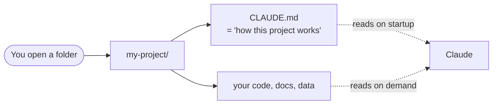

# 3. Set Up a Project

> **Time:** 3 min · **Goal:** Make Claude understand your project the moment you open it.

---

## The big idea

Claude reads the folder you're in. The more it knows about your project, the better it helps. The trick: **leave a note for Claude** in a file called `CLAUDE.md`.



`CLAUDE.md` is just a plain text file you write once. Claude reads it automatically every time you start a session in that folder.

---

## What a project folder looks like

```
my-project/
├── CLAUDE.md             ← the note for Claude (you create this)
├── .claude/              ← settings folder (optional)
│   ├── settings.json     ← team-shared settings
│   └── commands/         ← your custom shortcuts
├── src/                  ← your code or content
└── README.md             ← your project's own readme
```

Don't worry about `.claude/` yet – we'll get to that. For now, just `CLAUDE.md`.

---

## Two flavors of `CLAUDE.md`

| File | Where | What it does |
|---|---|---|
| `~/.claude/CLAUDE.md` | Your home folder | Personal preferences – loaded **everywhere** |
| `<project>/CLAUDE.md` | Inside a project | Project context – loaded **only there** |

Both load automatically.

---

## The fastest way to make a `CLAUDE.md`

Open a project folder, run `claude`, and type:

```
/init
```

Claude looks at the folder and writes a draft `CLAUDE.md` for you. You can edit it after.

---

## A good `CLAUDE.md` template

Copy this, save it as `CLAUDE.md` at the root of your project, fill in the blanks:

```markdown
# Project: <name>

## What it is
One paragraph describing what this project does.

## Tech / tools
- Language, framework, key libraries
- Database, services we depend on

## How to run
- `npm run dev` (or whatever)
- `npm test`

## Conventions
- How we write code (style, naming, formatting)
- How we write commit messages

## Gotchas
- Things a new contributor would hit – auth quirks, env vars, flaky tests
```

Keep it short – under 150 lines. Long files dilute attention.

---

## Useful slash commands inside Claude

Once `claude` is running, type these:

| Type this | What it does |
|---|---|
| `/help` | Lists every command |
| `/init` | Auto-writes a `CLAUDE.md` for the current folder |
| `/clear` | Forgets the conversation, keeps the `CLAUDE.md` |
| `/plan` | Plan Mode – Claude proposes steps, waits for your "yes" before changing files |
| `/review` | Reviews your latest changes |
| `/cost` | Shows tokens and cost so far |

---

**Next:** [Try real examples →](04-examples.md)
