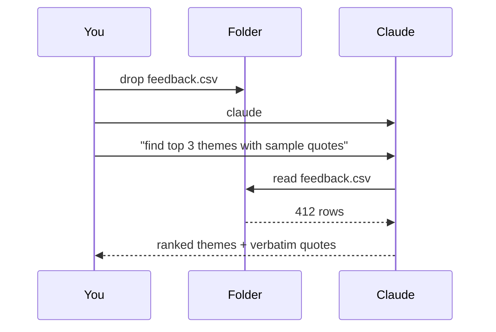
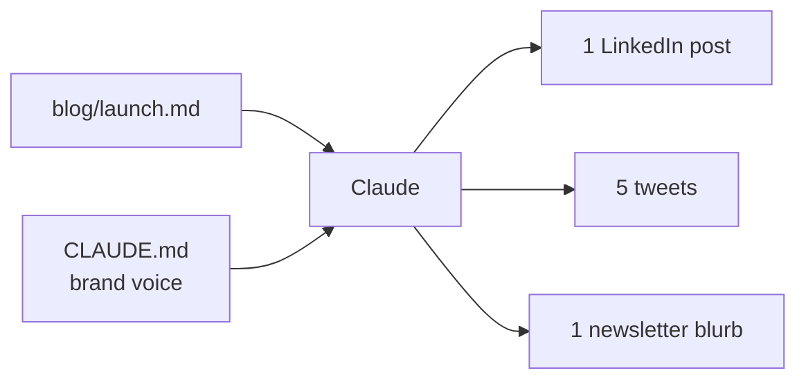
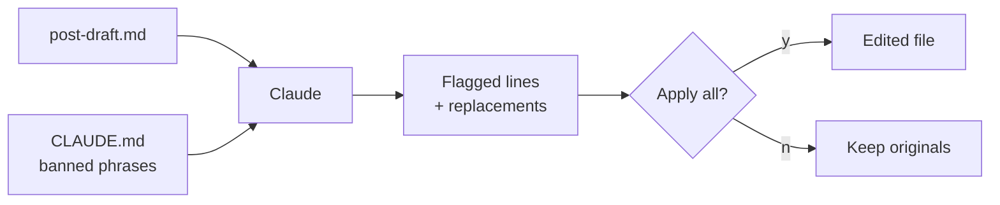

# 4. Real Examples

> **Time:** 5 min · **Goal:** See Claude do something useful for your actual work.

Each example below shows the flow and what your screen will look like. Pick one and try it today.

> **Marketing or content work:** start here. **Working on code?** The same patterns apply – see [the official docs](https://docs.claude.com/en/docs/claude-code) for code-flavored examples.

---

## Example 1 – Find themes in customer feedback

**Use case:** 200+ NPS comments, survey replies, or support tickets. You need three clean themes for tomorrow's leadership update.



**On your screen:**

> **Terminal**

```
~/feedback $ claude

  > Read feedback.csv. Find the top 3 themes.
    For each: 2 verbatim quotes + suggested fix.

  Reading 412 rows... done.

  1. Onboarding friction (87 mentions)
     "Took 4 days to figure out the import flow."
     "Wish there was a setup wizard."
     → suggest: build a guided first-run.

  2. Pricing confusion (54)
  3. Missing export (38)
  > _
```

---

## Example 2 – Turn one blog post into ten social posts

**Use case:** You wrote a 1,500-word article. You need LinkedIn, Twitter, and a newsletter blurb – all in your brand voice.



**On your screen:**

> **Terminal**

```
  > Read blog/launch.md. Use CLAUDE.md voice rules.
    Generate:
    – 1 LinkedIn post (under 200 words, 1 emoji)
    – 5 tweets (under 250 chars, no emojis)
    – 1 newsletter blurb (3 sentences, no CTA)

  Drafts ready. Save them under /social/ ?  [y/N]
```

Press `y` and you have a full week of social ready to schedule.

---

## Example 3 – Draft headlines that already sound like you

**Use case:** Three headline variants for a feature launch, on-brand, under 10 words.

**On your screen:**

> **Terminal**

```
  > Write 3 headline variants for our "focus mode"
    launch. Use CLAUDE.md voice rules.
    Sentence case. Under 10 words each.
    Try 3 angles: benefit, skeptical, story.

  1. Stop pretending notifications aren't the problem.
  2. Focus mode: one button, your afternoon back.
  3. We tried it for a week. You should too.
  > _
```

The point: Claude already knows your voice from `CLAUDE.md`, so you don't have to re-explain it every time.

---

## Example 4 – Tone-check and tighten existing copy

**Use case:** A draft mentions "leverage" and "ecosystem". You want a clean edit, not a rewrite.



**On your screen:**

> **Terminal**

```
  > Read post-draft.md. Flag every banned phrase
    from CLAUDE.md. Propose a one-line replacement
    for each. Don't change voice or structure.

  - Line 12: "leverage our ecosystem"
             → "use what we built"
  - Line 19: "world-class team"
             → "team that's been there"
  - Line 27: "game-changer"
             → "real shift"

  Apply all? [y/N] _
```

---

## Example 5 – Translate without losing your voice

**Use case:** Localize an email sequence to French and Spanish, brand voice preserved, no machine-translation feel.

**On your screen:**

> **Terminal**

```
  > Translate emails/welcome.md into French
    (formal "vous") and Spanish (neutral).
    Keep tone playful. Don't translate brand name
    or product feature names.

  ✓ emails/welcome.fr.md
  ✓ emails/welcome.es.md
  ✓ emails/glossary.md  (preserved terms)

  Want me to translate the rest of /emails/ too?
  > _
```

---

## What's next?

You've seen the loop: open a folder → run `claude` → ask in plain English. Once you're comfortable:

- **[Skills](https://docs.claude.com/en/docs/claude-code/skills)** – save reusable instructions ("turn any blog post into social") that Claude can invoke automatically.
- **[Hooks](https://docs.claude.com/en/docs/claude-code/hooks)** – run shell commands on events (e.g. auto-tone-check before commit).
- **[MCP servers](https://docs.claude.com/en/docs/claude-code/mcp)** – connect Claude to your CMS, analytics, or CRM.
- **[Subagents](https://docs.claude.com/en/docs/claude-code/sub-agents)** – delegate isolated tasks (research, drafting, fact-checking) in parallel.

Official docs: [docs.claude.com/en/docs/claude-code](https://docs.claude.com/en/docs/claude-code).
