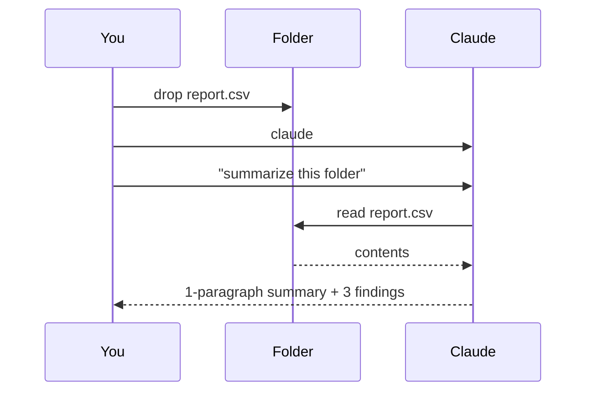
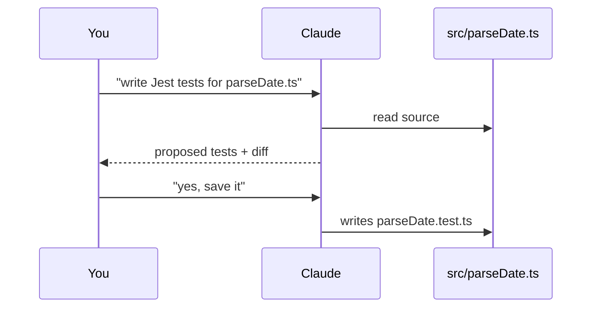
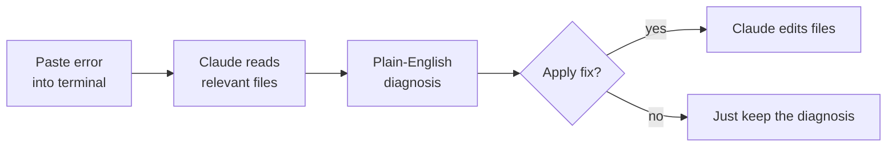
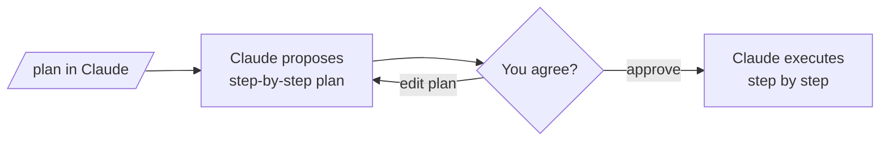

# 4. Real Examples

> **Time:** 5 min · **Goal:** See Claude do something useful in your own terminal.

Each example is copy-pasteable. Each shows a flow diagram and what your screen will look like.

---

## Example 1 – Drop a file, get a summary

**Use case:** You have a CSV / PDF / log / contract and want a quick read.



**On your screen:**

```
┌─ Terminal ──────────────────────────────────────────┐
│  ~/analyze $ claude                                 │
│                                                     │
│   ◆ Welcome to Claude Code                          │
│   > Read the file in this folder. Give me:         │
│     1. a one-paragraph summary,                     │
│     2. three bullet points of key findings,         │
│     3. anomalies worth investigating.               │
│                                                     │
│   Reading report.csv (1,420 rows)... done.          │
│   Summary: Q1 sales data for the EMEA region…      │
│   • Top product is Widget X (38% of revenue).       │
│   • Revenue grew 12% vs Q4.                         │
│   • Row 47 has a missing 'date' field.              │
│   > _                                               │
└─────────────────────────────────────────────────────┘
```

Follow up with anything: *"show me row 47"* or *"plot column B as a histogram"*.

---

## Example 2 – Generate tests for a function

**Use case:** You have code and want test coverage without writing it yourself.



**On your screen:**

```
┌─ Terminal ──────────────────────────────────────────┐
│   > Look at src/utils/parseDate.ts. Write Jest      │
│     tests covering valid ISO strings, invalid       │
│     input, and timezone edge cases. Save next to    │
│     the source file.                                │
│                                                     │
│   I'll create src/utils/parseDate.test.ts with 9    │
│   tests. Here's the diff:                           │
│   + describe('parseDate', () => {                   │
│   +   it('handles valid ISO strings', () => {...}); │
│   +   ...                                           │
│   Apply this change? [y/N] _                        │
└─────────────────────────────────────────────────────┘
```

Press `y`, the file is created. Run `npm test` to verify.

---

## Example 3 – Explain a stack trace

**Use case:** A confusing error, fast diagnosis.



**On your screen:**

```
┌─ Terminal ──────────────────────────────────────────┐
│   > [paste stack trace]                             │
│   > Explain this in plain English. What likely      │
│     caused it, and what's the fix?                  │
│                                                     │
│   This is a TypeError because `user` was undefined  │
│   when fetchProfile() ran. Looking at api/user.ts   │
│   line 42, the `await` is missing on the database   │
│   call. The fix: add `await`.                       │
│                                                     │
│   Want me to apply the fix? [y/N] _                 │
└─────────────────────────────────────────────────────┘
```

---

## Example 4 – Plan Mode for bigger changes

**Use case:** A multi-file refactor you want Claude to think through first.



**On your screen:**

```
┌─ Terminal ──────────────────────────────────────────┐
│   > /plan                                           │
│   > Refactor the auth module to use the new         │
│     session API. Don't change the public interface. │
│                                                     │
│   Plan:                                             │
│   1. Inventory callers of authenticate()            │
│   2. Replace internals with sessionApi.create()     │
│   3. Update tests in auth/auth.test.ts              │
│   4. Verify public types unchanged                  │
│                                                     │
│   Approve plan? [y/N/edit] _                        │
└─────────────────────────────────────────────────────┘
```

---

## Example 5 – Review before pushing

**Use case:** A second pair of eyes before `git push`.

```
┌─ Terminal ──────────────────────────────────────────┐
│   ~/repo $ claude                                   │
│   > /review                                         │
│                                                     │
│   Reviewed your last 3 commits:                     │
│   ✓ Tests look good                                 │
│   ⚠ src/api.ts:88 – missing error handling for      │
│     the timeout case                                │
│   ⚠ Commit message is vague – consider rewording    │
│   > _                                               │
└─────────────────────────────────────────────────────┘
```

---

## What's next?

You've seen the loop: open a folder → run `claude` → ask in plain English. From here:

- **[Skills](https://docs.claude.com/en/docs/claude-code/skills)** – package reusable instructions Claude can invoke automatically
- **[Hooks](https://docs.claude.com/en/docs/claude-code/hooks)** – run shell commands on tool events
- **[MCP servers](https://docs.claude.com/en/docs/claude-code/mcp)** – give Claude access to your databases, APIs, internal tools
- **[Subagents](https://docs.claude.com/en/docs/claude-code/sub-agents)** – delegate isolated tasks in parallel

Official docs: [docs.claude.com/en/docs/claude-code](https://docs.claude.com/en/docs/claude-code).
